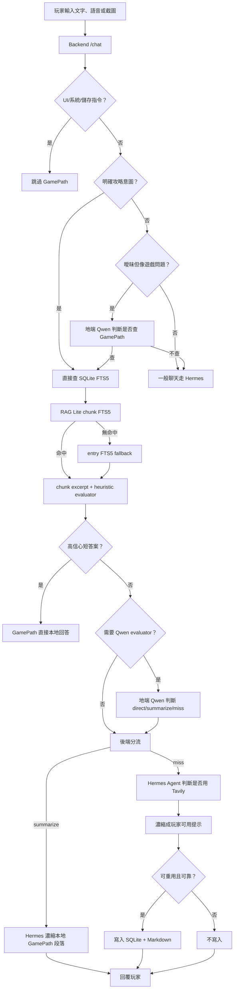
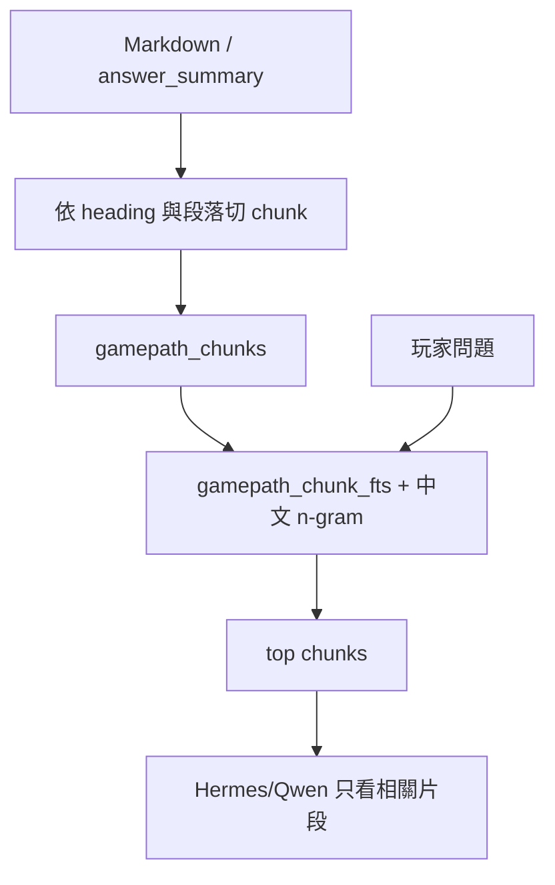
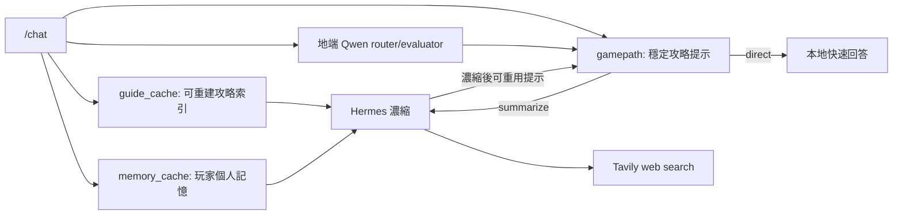
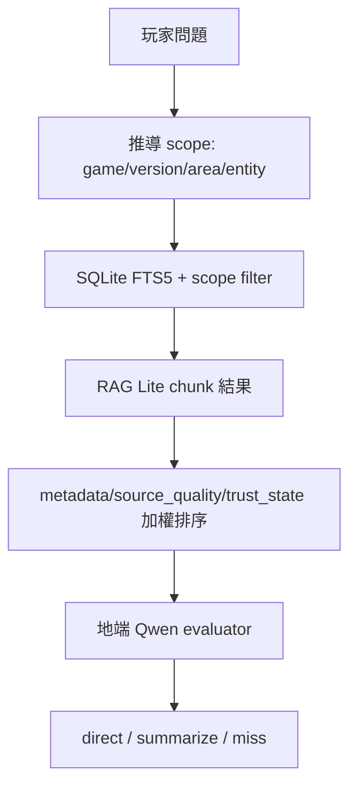
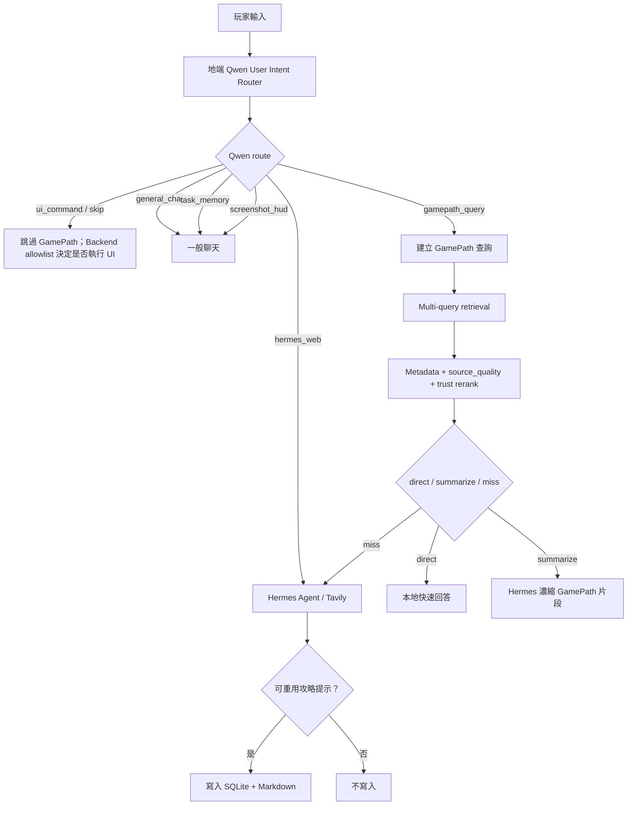
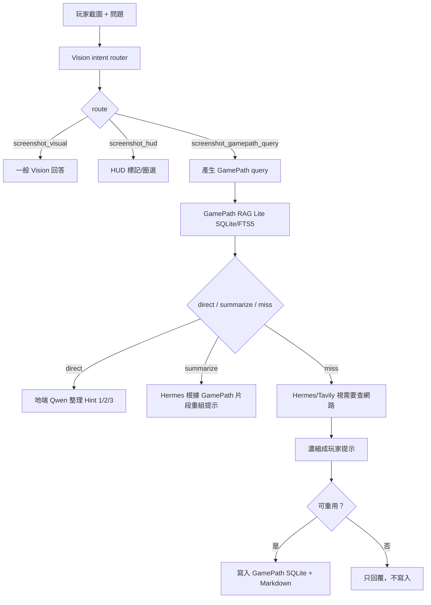

# GamePath 雲地混和版架構文件

最後更新：2026-06-06

## 目的

GamePath 是「遊戲陪伴」的本地攻略知識庫。它保存的是玩家可重用的攻略提示，不是 raw web search 結果，也不是整頁攻略網站內容。

目前版本是雲地混和架構：

- 雲端 Hermes Agent 負責主要聊天、Tavily web search、較複雜的推理與 vision/HUD 回答。
- 地端 llama.cpp Qwen3.5-4B Q4_K_M 負責 GamePath 語意路由與 retrieval evaluator。
- SQLite + Markdown 是穩定資料層，雲端與地端模型都共用同一份 GamePath。

GamePath 的核心原則是：能本地回答就不要查網路；需要查網路時，由 Hermes/Tavily 找資料，再把可重用的濃縮提示寫回本地。

## 目前啟動模式

雲地混和版使用：

- `start_game_companion_hybrid_qwen35_4b.bat`
- `start_game_companion_hybrid_qwen35_4b.ps1`

啟動後的主要服務：

| 服務 | 位置 | 用途 |
| --- | --- | --- |
| GUI | `overlay-chat.exe` | 遊戲陪伴主視窗、Task、Game Search、GamePath 視窗 |
| Backend | `http://127.0.0.1:8000` | `/chat`、GamePath API、截圖、HUD、語音等 |
| Local Qwen Router | `http://127.0.0.1:18081` | llama.cpp Vulkan，Qwen3.5-4B Q4_K_M，地端語意路由 |
| Hermes Agent | WSL/外部 Hermes | 雲端模型、Tavily web search、主回答生成 |

重要環境設定：

| 設定 | 目前用途 |
| --- | --- |
| `IGPU_CHAT_BACKEND=hermes` | 主聊天走 Hermes |
| `LLAMA_AUTO_START=0` | 不啟動舊的主 llama.cpp chat server |
| `HERMES_AGENT_WEB_ENABLED=1` | Hermes 可使用 web tool，例如 Tavily |
| `IGPU_LOCAL_ROUTER_ENABLED=1` | 啟用地端 Qwen router |
| `IGPU_LOCAL_ROUTER_URL=http://127.0.0.1:18081` | 地端 router OpenAI-compatible endpoint |
| `IGPU_LOCAL_ROUTER_MODEL=qwen3.5-4b-q4_k_m` | 地端 router 模型名稱 |
| `IGPU_LOCAL_ROUTER_GAMEPATH_GATE=1` | 啟用 GamePath / intent 語意 gate |
| `IGPU_LOCAL_ROUTER_ALWAYS_ROUTE=1` | 每次文字輸入都先交給 Qwen 判斷 user intent |
| `IGPU_LOCAL_ROUTER_RETRIEVAL_EVAL=1` | 啟用 Qwen retrieval evaluator |
| `IGPU_LOCAL_ROUTER_CACHE_TTL=600` | router 判斷快取 600 秒 |

## 核心分工

| 模組 | 位置 | 責任 |
| --- | --- | --- |
| SQLite | `gamepath/gamepath.sqlite` | 結構化索引、entry FTS5、chunk FTS5、聊天流程主要查詢入口 |
| Markdown | `gamepath/notes/{game_id}/{entry_id}.md` | 人類可讀攻略筆記，未來可作 LLM-wiki 原始資料 |
| 後端 API | `llama_vulkan_api_server.py` | GamePath CRUD、搜尋、評分、路由、寫入規則 |
| 地端 Qwen router | llama.cpp Vulkan on `18081` | 判斷所有文字輸入的 user intent、產生 GamePath query/tags、判斷候選資料是否可靠 |
| Hermes Agent/Tavily | Hermes web agent | GamePath 不足時查網路並生成玩家提示 |
| GamePath 視窗 | `overlay-chat/src/gamepath.*` | 查看、搜尋、刪除、Ask 指定條目 |
| 聊天主視窗 | `overlay-chat/src/main.js` | 顯示 GamePath 狀態、接收 Ask、通知 GamePath 視窗刷新 |

## 資料模型

主要資料表是 `gamepath_entries`。一筆資料代表一個可重用攻略提示。

| 欄位 | 用途 |
| --- | --- |
| `id` | 條目 ID |
| `game_id` | 遊戲識別，例如目前選定遊戲、偵測到的遊戲，或 `global` |
| `title` | 條目標題 |
| `question` | 原始問題或寫入時的查詢意圖 |
| `answer_summary` | 濃縮後的玩家提示，或手動匯入的攻略內容 |
| `markdown_path` | 對應 Markdown 檔路徑 |
| `tags` | 標籤，例如 `auto,hermes,guide`、`vision` |
| `spoiler_level` | `none`、`low`、`medium`、`high`、`full` |
| `spoiler_rank` | spoiler level 的數值排序 |
| `source_type` | `manual`、`hermes_agent_web`、`hermes_agent_vision` 等 |
| `agent_used` | 是否由 Agent 產生或整理 |
| `trust_state` | `unverified`、`verified`、`disputed`、`needs_review`、`deprecated` |
| `dispute_count` | 玩家回報不符合的次數 |
| `last_feedback` | 最近一次玩家回報 |
| `content_hash` | 用 `game_id + question` 去重 |
| `created_at` / `updated_at` | 建立與更新時間 |

SQLite 另外有三個索引層：

| 表 | 用途 |
| --- | --- |
| `gamepath_fts` | entry-level FTS5，保留舊搜尋與 fallback |
| `gamepath_chunks` | RAG Lite chunk metadata，一段 Markdown/攻略內容是一個 chunk |
| `gamepath_chunk_fts` | chunk-level FTS5，聊天搜尋預設先走這裡 |

`gamepath_fts` 與 `gamepath_chunk_fts` 都會加入中文 n-gram 擴展文字。這讓中文短句比單純關鍵字搜尋更不容易漏掉。

## 總覽流程



## 路由機制

2026-06-05 更新：目前已切到 Full Qwen Intent Router。文字輸入會先交給地端 Qwen 判斷 `route`，再由 Backend 根據 route 決定是否查 GamePath、交給 Hermes/Tavily、走一般聊天、或跳過 GamePath。Backend 仍保留 allowlist 與 fallback；Qwen 不直接執行 UI 動作。

目前實際 route：

- `gamepath_query`：查 GamePath SQLite + RAG Lite。
- `hermes_web`：跳過本地攻略，交給 Hermes Agent / Tavily。
- `general_chat`：一般聊天，不查 GamePath。
- `ui_command`：UI/系統指令，跳過 GamePath；實際動作要由 Backend/Frontend allowlist 執行。
- `task_memory`：任務/玩家狀態語意，走既有記憶/聊天流程。
- `screenshot_hud`：截圖/HUD 語意，走既有圖片流程。
- `skip`：負向或不需要查詢。
- `clarify`：需要反問或保守處理。

以下三層說法是舊版設計脈絡，保留作歷史參考；現在明確攻略與曖昧攻略都會先由 Qwen intent router 判斷。

### 第一層：後端硬規則

後端會先攔掉明顯不該查 GamePath 的內容：

- 開關視窗、刪除、列表、儲存提示等 UI 指令
- 模型、GPU、backend、服務、透明度、重啟等系統問題
- 純粹的「幫我把攻略存下來」這類 save-only 指令
- 玩家個人記憶查詢，例如「我的名字是什麼」

這些會走 `gamepath_skipped` 或其他非 GamePath 流程，不會浪費 SQLite 搜尋或 Qwen router。

### 第二層：明確攻略意圖直接查本地

如果玩家問題已經很明確像攻略問題，例如：

- 物品用途
- 任務下一步
- boss 打法
- 地圖、路線、機關、謎題
- NPC、敵人、角色名稱
- 卡關、找不到、要無暴雷提示

後端會直接查 GamePath SQLite。這種情況不先問 Qwen router，因為多一次地端模型判斷反而會慢。

### 第三層：曖昧問題交給地端 Qwen

有些問題不明確，但可能跟遊戲攻略有關。例如玩家只說：

- 「這兩個是誰」
- 「這個能做什麼」
- 「我現在要去哪」
- 「是不是有兩個會唱歌的女殭屍」

這時才用地端 Qwen3.5-4B Q4_K_M 做語意 gate。Qwen router 只回 JSON：

```json
{
  "s": true,
  "q": "short query",
  "t": ["item", "quest"],
  "sp": "low",
  "c": "medium"
}
```

後端會把 `q` 當搜尋 query，`t` 當 tags，`sp` 當 spoiler level。router 結果會快取 600 秒。

## Retrieval Evaluator

SQLite FTS5 回來的候選結果，會先由後端做 lightweight evaluator。現在預設是 RAG Lite chunk search：

1. 從 `gamepath_chunk_fts` 找最相關 chunk。
2. 依 entry 聚合 top chunks。
3. 只取與 top chunk 分數接近的 1 到 3 段。
4. 如果 chunk search 沒命中，才 fallback 到舊的 `gamepath_fts` entry search。

評分會考慮：

- 同遊戲是否命中
- query 核心詞是否重疊
- FTS match coverage
- `answer_summary` 是否夠短、夠完整
- Markdown 長攻略是否過長
- spoiler level 是否符合
- source type 與 trust state 是否可靠
- `dispute_count` 是否需要降權
- updated time 是否太舊

分數結果會變成三種路由：

| 結果 | 意義 |
| --- | --- |
| `direct` | 高信心、短答案，可直接本地回答 |
| `summarize` | 有相關資料，但要模型濃縮或抽段落 |
| `miss` | 本地資料不足，交給 Hermes/Tavily |

如果結果不是 `direct`，而且 `IGPU_LOCAL_ROUTER_RETRIEVAL_EVAL=1`，會再交給地端 Qwen 看前 3 個候選，讓它判斷 `direct`、`summarize` 或 `miss`。這是目前雲地混和版最重要的地端模型介入點。

## 長攻略 Markdown 處理

如果 GamePath 裡有一份「整個攻略」型 `.md`，系統不會因為命中一個關鍵字就把全文吐給玩家。

目前 GamePath RAG Lite 會在寫入或 migration 時先建立 chunk index：



處理流程：

1. 判斷內容是否過長：
   - 超過 `GAMEPATH_DIRECT_MAX_CHARS=900`
   - 或 Markdown heading 很多
2. 依 `#`、`##`、`###`、`####` 切章節。
3. 章節仍太長時，再切成 passage。
4. 對 passage 做 query relevance scoring。
5. 寫入 `gamepath_chunks` 與 `gamepath_chunk_fts`。
6. 查詢時只保留最相關的 1 到 3 段，總長限制在 `GAMEPATH_CONTEXT_MAX_CHARS=1800` 內。
7. 長攻略一律走 `summarize`，交給模型濃縮，不直接全文回答。

這樣玩家問「銀鑰匙在哪」時，模型只會拿到銀鑰匙附近的攻略段落，不會同時拿到 boss、結局或其他無關章節。

## Hermes/Tavily 介入時機

Hermes/Tavily 只會在本地不足時進場。

會進場的情況：

- GamePath 沒有命中
- GamePath 命中分數太低
- GamePath 條目被玩家 dispute，需要重新驗證
- guide_cache 或 memory_cache 只有弱上下文，需要 Hermes 整理
- 玩家問題需要目前網路攻略、版本差異、場景提示

不會進場的情況：

- GamePath `direct` 高信心命中
- 問題是 UI 或系統操作
- 問題只是要打開、關閉、刪除、列出資料
- 地端 Qwen router 判斷不需要 GamePath，且沒有攻略意圖

Hermes Agent 可以使用 Tavily，但 raw web result 不保存。後端會先呼叫 `condense_agent_answer()`，只保留玩家可用提示。

## 寫入 GamePath 的時機

GamePath 寫入分成手動與自動。

### 手動寫入

入口：

- `POST /gamepath/add`
- 後端其他流程呼叫 `add_gamepath_sync()`

寫入時會同步做：

1. 建立或更新 SQLite row
2. 寫入 Markdown
3. 更新 entry FTS5 index
4. 更新 RAG Lite chunk index
5. 送出 `gamepath:changed`，讓 GamePath 視窗刷新

### 自動寫入

自動寫入發生在 Hermes Agent 回答之後。它必須通過 `gamepath_store_skip_reason()` 檢查。

會寫入：

- Agent 有介入
- 問題是攻略、物品用途、任務、boss、地圖、路線、謎題等可重用內容
- 回答至少有基本長度
- 回答已濃縮成玩家可用提示
- 沒有明顯 timeout、error、不確定、找不到

不寫入：

- 閒聊
- UI 或系統問題
- 太短的答案
- generic 問答，例如「請告訴我道具名稱」但沒有實際攻略內容
- 回答包含太多不確定語氣且沒有可執行提示
- 只有 raw URL 或來源清單

Vision/HUD 流程如果由 Hermes Agent 產生可重用攻略提示，也可能寫入，source type 會是 `hermes_agent_vision`。

## 玩家回報錯誤

攻略可能因版本、場景、進度不同而不準。當玩家說：

- 「沒有看到」
- 「找不到」
- 「不是你說的」
- 「版本不一樣」
- 「這邊沒有」

後端會找最近一次使用的 GamePath 條目，並：

1. 將 `trust_state` 改成 `disputed`
2. `dispute_count + 1`
3. 保存玩家回報到 `last_feedback`
4. 更新 Markdown
5. 下次 evaluator 對該條目降權

被 dispute 的條目通常不會再直接快速回答，而會進入 summarize 或 miss 流程，讓 Hermes 重新驗證。

## 前端狀態

聊天主視窗會顯示目前走哪條路。

| 狀態 | 意義 |
| --- | --- |
| `gamepath_skipped` | 後端判斷不是攻略型問題，跳過 GamePath SQLite |
| `gamepath_hit` | GamePath 高信心命中，直接用本地資料回答 |
| `gamepath_summarizing` | GamePath 找到資料，但需要模型濃縮 |
| `gamepath_miss` | GamePath 沒有足夠命中，交給 Hermes/Tavily |
| `guide_context` | 舊 `guide_cache` 有命中，交給 Hermes 整理 |
| `memory_context` | 玩家記憶有命中，交給 Hermes 參考 |
| `agent_may_search_web` | 本地不足，Hermes 可能用 Tavily |
| `agent_no_tools` | 沒有 web tool，只由 Hermes 無工具回答 |
| `gamepath_stored` | 回答已濃縮並寫入 GamePath |
| `gamepath_not_stored` | 回答不符合可重用條件，未寫入 |
| `gamepath_disputed` | 玩家回報上一個提示不符合，條目已降權 |
| `gamepath_feedback_missing` | 玩家回報問題，但找不到上一筆可標記條目 |

如果狀態前面出現 `Qwen route ->`，代表地端 Qwen 參與了「要不要查 GamePath」。

如果狀態前面出現 `Qwen eval ->`，代表地端 Qwen 參與了「候選資料是否足夠可靠」。

## GamePath 視窗

GamePath 子視窗目前提供：

- 顯示目前 DB 筆數
- 依目前遊戲過濾
- 搜尋 GamePath
- 顯示最近條目
- 顯示 trust、dispute、spoiler、source metadata
- 預覽相關摘要，不直接展示整篇長攻略
- Ask：把指定條目帶回主聊天，請模型整理下一步
- Delete：刪除 SQLite row 與對應 Markdown
- 自動刷新：收到 `gamepath:changed`、視窗 focus，或 health revision 變化時更新

## API

| API | 用途 |
| --- | --- |
| `POST /gamepath/add` | 新增或更新 GamePath 條目 |
| `POST /gamepath/search` | 搜尋 GamePath，回傳 evaluation 與結果 |
| `GET /gamepath/recent` | 取得最近 GamePath 條目 |
| `POST /gamepath/feedback` | 標記條目為 disputed、needs_review 等 |
| `DELETE /gamepath/{entry_id}` | 刪除條目與對應 Markdown |
| `GET /health` | 回傳 GamePath 與 local router 狀態 |

`/health` 目前會包含：

- `gamepath_enabled`
- `gamepath_db_exists`
- `gamepath_entry_count`
- `gamepath_chunk_count`
- `gamepath_last_updated_at`
- `local_router_enabled`
- `local_router_url`
- `local_router_model`
- `local_router_ready`
- `local_router_gamepath_gate`
- `local_router_retrieval_eval`
- `local_router_cache_ttl_seconds`

## 與其他資料層的關係



| 資料層 | 保存內容 | 是否可重建 | 用途 |
| --- | --- | --- | --- |
| `memory_cache` | 玩家偏好、進度、任務記憶 | 可部分重建 | 個人上下文 |
| `guide_cache` | 匯入攻略文件的搜尋索引 | 可重建 | 原始攻略片段搜尋 |
| `gamepath` | 經整理的可重用玩家提示 | 不應任意重建覆蓋 | 穩定攻略知識庫 |

## 地端模型可以介入的位置

地端 Qwen3.5-4B 目前介入三個點：

1. User intent router / GamePath semantic gate
   每次文字輸入都先判斷 user intent，包含 UI/系統指令、明確攻略、曖昧遊戲問題、web/current 問題與一般聊天。

2. GamePath retrieval evaluator
   判斷 SQLite 找到的候選是否真的回答了玩家問題。

3. 未來可擴充的本地摘要
   目前 summarize 主要仍走 Hermes。未來可以讓地端模型處理低風險、低 token 的本地摘要，雲端只處理複雜推理與 web search。

不建議讓地端模型直接寫 SQLite。所有寫入仍由後端控管，避免模型自己製造重複、錯誤或污染資料庫的條目。

## 設計取捨

### 優點

- 明確攻略與曖昧攻略都交給 Qwen 判斷，流程更像 Agent，也更能處理口語。
- Backend 仍保留 allowlist / fallback，避免 Qwen 直接執行危險或未支援 UI 動作。
- GamePath hit 能避開 Hermes/Tavily，減少延遲與雲端成本。
- 查網路後只保存濃縮提示，不保存 raw source，資料庫比較乾淨。
- SQLite/Markdown 與模型解耦，未來換 Hermes 或 Qwen 仍可沿用。
- RAG Lite 不新增 embedding model；iGPU/RAM 壓力低，chunk index 可刪可重建。

### 成本

- 地端 Qwen router 會讓每句文字多一次本機推論延遲，平均約 0.8 到 1.6 秒，遊戲中可能更有感。
- 目前仍是 FTS5 + evaluator，不是完整 embedding semantic search。
- 長攻略的 passage scoring 是 lightweight 方法，不是重型 reranker。
- chunk FTS 對完全不相關的 miss 可能比 entry FTS 慢一點，所以聊天流程前面仍需要 router/gate 避免亂查。
- `verified` 狀態還沒有完整 UI 流程。

## 目前限制與下一步

目前限制：

- GamePath RAG Lite 仍不是完整向量資料庫。
- 地端 Qwen 只做路由與 evaluator，還沒有正式接管摘要生成。
- GamePath 視窗可以查看、搜尋、刪除、Ask，但還不是完整人工編輯器。
- 長攻略 chunk index 已有，但還沒有 embedding/reranker adapter。

建議下一步：

- 新增人工「編輯條目」視窗。
- 新增 `verified` 按鈕，讓玩家確認有效攻略。
- 加入 embedding 或 local reranker，改善短 query 查長攻略。
- 在回覆中顯示本次使用的 GamePath entry id/title。
- 讓地端 Qwen 處理低風險本地摘要，進一步降低雲端呼叫次數。

## 數千筆資料優化

目前 GamePath 對數千筆資料採用「先縮小範圍，再搜尋，再評估」策略。

新增 metadata scope：

- `version`
- `area`
- `entity_type`
- `entity_name`
- `source_quality`

寫入 GamePath 時，後端會優先使用 API 傳入的 metadata；如果沒有，就從玩家問題、tags 與答案中做輕量推導。這些欄位會寫入 SQLite，也會出現在 Markdown header，方便未來 LLM-wiki 使用。

搜尋流程：



非 strict 搜尋會保留舊資料 fallback：

- 有 `entity_type/version/area` 的資料會優先比對。
- 舊資料如果欄位是空白，不會被硬排除。
- 有 `disputed/needs_review/deprecated` 的條目會被降權。
- `source_quality` 越高，排序略微加分。

Memory 查詢也已收斂：

- 一般聊天只查 `state`、`preference`。
- 任務/下一步/目前目標問題才查 `task`。
- 明確問「記憶/筆記/之前說過什麼」才查 `note`。
- 截圖/Task 分析仍可查 `task`，因為它和玩家當前目標相關。

這樣做的目標是避免數千筆資料時，舊任務、泛用 tags 或長篇攻略把 Hermes context 污染掉。

## 目前最終流程與演算法

這一版 GamePath 採用「Qwen 先判斷所有文字輸入意圖、Backend 負責安全執行、SQLite 多查詢召回、後端 rerank、必要時才交給 Hermes」的流程。



### 1. Qwen 先判斷所有文字輸入

現在 `IGPU_LOCAL_ROUTER_ALWAYS_ROUTE=1`，所以只要是文字 `/chat` 輸入，地端 Qwen3.5-4B Q4_K_M 會先判斷使用者意圖。它不直接執行任何動作，只輸出 route 與搜尋欄位。

Qwen User Intent Router 只負責輸出結構化 JSON：

- `route`: `gamepath_query`、`hermes_web`、`general_chat`、`ui_command`、`task_memory`、`screenshot_hud`、`skip`、`clarify`
- `query`: 搜尋用短 query，中文問題會保留中文，不翻成英文
- `query_variants`: 原句與 Qwen 改寫一起保留
- `tags`: 軟性 scoring tags，不再做硬過濾
- `spoiler_level`: 預設低暴雷
- `ui_action`: Qwen 建議的 UI 動作，但 Backend 只會執行 allowlist 內的安全動作

### 2. Backend 仍是執行裁判

Qwen 判斷意圖，但 Backend 負責真正分流：

- `gamepath_query` 才會查 SQLite GamePath。
- `hermes_web` 會跳過 GamePath，交給 Hermes Agent / Tavily。
- `general_chat`、`task_memory`、`screenshot_hud` 目前不查 GamePath，會走既有聊天、記憶或截圖流程。
- `ui_command`、`skip` 會跳過 GamePath；UI action 不會因為 Qwen 一句話就直接執行，必須通過 Backend/Frontend allowlist。

這樣做的目標是讓「明確攻略問題」與「曖昧遊戲問題」統一交給 Qwen 判斷，流程比較像 Agent；代價是每句文字都會多一次地端 Qwen latency。

### 3. Multi-query retrieval

搜尋不只用 Qwen 改寫後的一句話，而是合併多個 query variant：

- 玩家原句
- Qwen 改寫 query
- 後端語意提示，例如「拿刀追我」擴展成「屠夫/打法/弱點」
- 去掉英文泛稱後的中文核心詞，避免 `boss/route` 這種 generic token 把 FTS 帶歪
- `場景 + 具體語意詞` 短查詢，例如「廚房 屠夫 打法」
- `場景 + 優先意圖` 短查詢，例如「醫院 下一步」

每個 variant 都查 `gamepath_chunk_fts`，再合併同一 entry。這讓短句、口語句、Qwen 改寫失真時仍有機會召回正確條目。

### 4. Ranking / 評分

排序不只看 FTS 分數。後端會綜合：

- `game_id` 是否一致
- `area / entity_type / entity_name / version` metadata 是否吻合，area 支援 partial match
- tags 只加減分，不硬排除
- semantic hint overlap
- `source_quality`
- `trust_state`、`dispute_count`
- spoiler level
- 回答長度與 chunk relevance

這版特別降低「長文 + 泛用詞多」的優勢，提高 `metadata` 與 `source_quality` 權重，避免泛用攻略壓過短而精準的玩家筆記。

### 5. 截圖攻略模式

2026-06-06 更新：有截圖的 `/chat` 不再一律跳過 GamePath。後端會先讓 Vision 模型看「圖片 + 玩家文字」，輸出一個輕量 intent JSON，再決定要走哪條路。

這層不是固定問句規則，而是讓模型判斷玩家現在是在：

- 單純問畫面看到了什麼：`screenshot_visual`
- 要圈出、標記、指方向：`screenshot_hud`
- 拿截圖問攻略、路線、怪物打法、謎題、道具用途或卡關：`screenshot_gamepath_query`
- 明確要上網或最新社群資訊：`hermes_web`

截圖攻略流程如下：



Vision intent router 會把畫面裡可辨識的場景、敵人、物品、UI 文字與玩家問題合成短 query，例如「療養院 一樓西側 廚房 主廚喪屍 怎麼打」。這能避免玩家只說「這裡怎麼辦」時直接拿模糊句子查 SQLite。

狀態泡泡會顯示類似：

```text
搜尋路徑：Vision → GamePath → 本地回答 | 準確度 82% / 覆蓋 64% | 耗時 Vision判斷 4s / SQLite 42ms / Qwen提示 12s
```

### 6. Hermes / Tavily 介入時機

Hermes Agent 只在三種情況介入：

- 玩家明確要求上網、最新資料、社群稱呼、版本差異、speedrun/meta。
- GamePath miss 或本地資料信心不足。
- 條目被玩家回報不符，需要重新驗證。

Hermes/Tavily 查到的 raw result 不會原樣存入 GamePath。後端只保存濃縮後、可重用、低暴雷的「玩家可用提示」。

### 7. 目前 500 筆測試結果

最新測試報告在 `docs/gamepath_semantic_router_500_report.md`。

- Backend-only end-to-end accuracy：58.82%
- 地端 Qwen router + multi-query + rerank end-to-end accuracy：100.00%
- GamePath Top-1 accuracy：100.00%
- 實際 Qwen router 平均延遲：約 843.76 ms
- SQLite 搜尋平均延遲：約 187.33 ms

結論：目前 iGPU 版本先不引入 embedding model，使用 FTS5 + 中文 n-gram + Qwen semantic gate + metadata rerank，已足以支撐 500 筆測試資料。下一步才需要測 5,000 筆與 router cache hit/miss。
