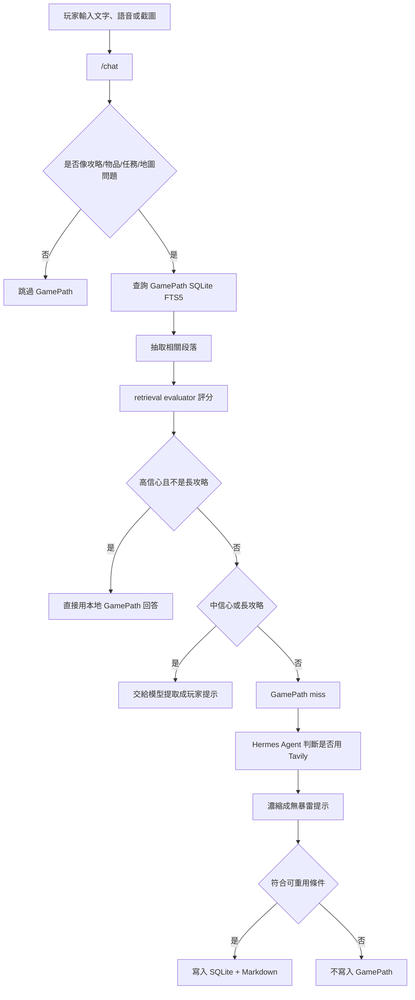
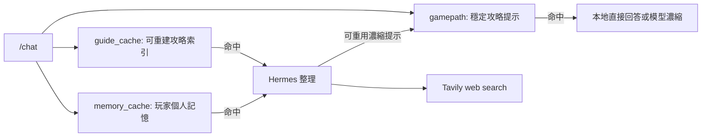

# GamePath 架構文件

## 目的

GamePath 是「遊戲陪伴」裡的本地攻略知識庫。它的目標不是保存整個網頁或整本攻略給玩家看，而是把可重用的攻略提示整理成穩定資料，讓聊天時可以快速找到、再由模型提取成當下需要的無暴雷提示。

GamePath 同時服務雲端 Hermes Agent 版與本地 llama.cpp/Qwen 版。它位於後端，不直接綁死在任一模型上，因此即使之後更換 Hermes 或模型，SQLite 與 Markdown 仍可沿用。

## 核心分工

| 模組 | 位置 | 責任 |
| --- | --- | --- |
| SQLite | `gamepath/gamepath.sqlite` | 結構化索引、FTS5 搜尋、聊天流程的主要查詢入口 |
| Markdown | `gamepath/notes/{game_id}/{entry_id}.md` | 人類可讀攻略筆記，未來可作 LLM-wiki 原始資料 |
| 後端 API | `llama_vulkan_api_server.py` | GamePath CRUD、搜尋、評分、路由、寫入規則 |
| GamePath 視窗 | `overlay-chat/src/gamepath.*` | 查看、搜尋、刪除、Ask 指定條目 |
| 聊天主視窗 | `overlay-chat/src/main.js` | 顯示 GamePath 狀態、接收 Ask、更新 GamePath 視窗 |
| Hermes Agent/Tavily | 外部 Agent 流程 | GamePath 不足時才由 Agent 判斷是否查網路 |

## 資料模型

主要資料表是 `gamepath_entries`，一筆資料代表一個可重用攻略提示。

| 欄位 | 用途 |
| --- | --- |
| `id` | 條目 ID |
| `game_id` | 遊戲識別，例如目前選定遊戲或 `global` |
| `title` | 條目標題 |
| `question` | 原始問題或寫入時的查詢意圖 |
| `answer_summary` | 濃縮後的玩家提示，或手動匯入的攻略內容 |
| `markdown_path` | 對應 Markdown 檔路徑 |
| `tags` | 標籤，例如 `auto,hermes,guide` |
| `spoiler_level` | `none`、`low`、`medium`、`high`、`full` |
| `spoiler_rank` | spoiler level 的數值排序 |
| `source_type` | `manual`、`hermes_agent_web`、`hermes_agent_vision` 等 |
| `agent_used` | 是否由 Agent 產生或整理 |
| `trust_state` | `unverified`、`verified`、`disputed`、`needs_review`、`deprecated` |
| `dispute_count` | 玩家回報不符合的次數 |
| `last_feedback` | 最近一次玩家回報 |
| `created_at` / `updated_at` | 建立與更新時間 |
| `content_hash` | 用 `game_id + question` 去重 |

SQLite 另外有 `gamepath_fts`，用 FTS5 儲存 `title`、`question`、`answer_summary`、`tags` 與擴展後的搜尋文字。中文搜尋會透過 n-gram 擴展，避免只靠單一完整詞造成漏搜。

## 整體流程

## 查詢流程

GamePath 查詢不是單純「關鍵字命中就吐內容」。目前分成五步：

1. `should_use_gamepath()`
   判斷這句話是否像攻略型問題。一般 UI、模型、GPU、透明度、重啟等問題會跳過 GamePath，避免每次聊天都打 SQLite。

2. `search_gamepath_sync()`
   使用 SQLite FTS5 搜尋，並套用 `game_id`、`spoiler_level`、`tags` 過濾。

3. `build_gamepath_relevant_context()`
   如果條目很長，會讀取對應 Markdown 或 `answer_summary`，切成章節/段落，只保留與問題最相關的小段。

4. `evaluate_gamepath_retrieval()`
   對候選結果評分，考慮同遊戲、核心詞重疊、FTS coverage、答案長度、spoiler、來源、更新時間、信任狀態、玩家 dispute 次數。

5. 路由結果
   評估結果會輸出 `direct`、`summarize` 或 `miss`，決定是否直接回覆、交給模型濃縮，或交給 Hermes/Tavily。

## 長攻略 `.md` 的處理

如果 GamePath 裡有一份「整個攻略」型 Markdown，現在不會因為命中一個關鍵字就把全文吐給玩家。

後端會先做：

1. 判斷是否為長內容：
   - 超過 `GAMEPATH_DIRECT_MAX_CHARS`
   - 或 Markdown heading 數量很多

2. 切分內容：
   - 依 `#`、`##`、`###`、`####` 章節切
   - 章節仍太長時再切成較小 passage

3. 對每段 passage 評分：
   - 問題核心詞是否出現
   - 是否出現在章節標題
   - 完整片語是否命中
   - 命中密度

4. 只取最相關的 1 到 3 段，總長限制在 `GAMEPATH_CONTEXT_MAX_CHARS` 內。

5. 長攻略即使分數很高，也會強制走 `summarize`，由模型整理成短提示，不走 `direct`。

這樣玩家問「銀鑰匙在哪」時，模型只會看到銀鑰匙附近的攻略段落，不會同時拿到 boss、結局或其他無關章節。

## 聊天路由狀態

前端目前會顯示這些 GamePath/查詢狀態：

| 狀態 | 意義 |
| --- | --- |
| `gamepath_skipped` | 不是攻略型問題，跳過 GamePath SQLite |
| `gamepath_hit` | GamePath 高信心命中，直接用本地資料回答 |
| `gamepath_summarizing` | GamePath 找到資料，但需要模型整理或長攻略抽取 |
| `gamepath_miss` | GamePath 沒有足夠高信心命中，交給 Hermes Agent 判斷是否 Tavily |
| `guide_context` | 舊的 `guide_cache` 有命中，交給 Hermes 整理 |
| `memory_context` | 玩家記憶有命中，交給 Hermes 參考 |
| `agent_may_search_web` | 本地不足，Hermes 可能使用 Tavily |
| `agent_no_tools` | 沒有 web tool，只由 Hermes 無工具模式回答 |
| `gamepath_stored` | Agent 回答被濃縮後寫入 GamePath |
| `gamepath_not_stored` | 回答不符合可重用條件，未寫入 |
| `gamepath_disputed` | 玩家回報上一個提示不符合，條目被降權 |
| `gamepath_feedback_missing` | 玩家回報問題，但找不到上一筆可標記 GamePath 條目 |

## 寫入流程

GamePath 寫入分成手動與自動。

### 手動寫入

透過：

- `POST /gamepath/add`
- 未來 UI 的「存到 GamePath」
- 或其他後端流程呼叫 `add_gamepath_sync()`

寫入後會同時：

1. 建立或更新 SQLite row
2. 寫入 Markdown 檔
3. 更新 FTS5 index
4. 前端收到 `gamepath:changed` 後刷新視窗

### 自動寫入

聊天流程中，當 GamePath miss 或 local context 不足時，Hermes Agent 可能用 Tavily 查網路。Agent 回答回來後，後端會先做 `condense_agent_answer()`，移除 raw references、URL、來源清單，只保留玩家可用提示。

符合條件才寫入：

- 問題像攻略/教學/物品用途/任務/boss/地圖
- Agent 有介入
- 答案夠長且不是失敗訊息
- 沒有明顯 timeout、error、不知道、不確定、沒找到
- 可形成未來重用的提示

不寫入：

- 閒聊
- UI 操作問題
- 模型/GPU/程式設定問題
- 太短或不確定的答案
- 明顯錯誤或查詢失敗

## 玩家回報錯誤

攻略可能會因版本、進度、地圖差異而不準。當玩家說「沒有看到」、「找不到」、「不是你說的」、「版本不一樣」等，後端會：

1. 找最近一次使用的 GamePath 條目
2. 將 `trust_state` 改為 `disputed`
3. `dispute_count + 1`
4. 保存玩家回報到 `last_feedback`
5. 更新 Markdown
6. 下次 retrieval evaluator 會降權該條目

被 dispute 的條目通常不會再直接快速回答，而會進入模型整理或 miss 流程，讓系統重新驗證。

## API

| API | 用途 |
| --- | --- |
| `POST /gamepath/add` | 新增或更新 GamePath 條目 |
| `POST /gamepath/search` | 搜尋 GamePath，回傳 evaluation 與結果 |
| `GET /gamepath/recent` | 取得最近 GamePath 條目 |
| `POST /gamepath/feedback` | 標記條目為 disputed、needs_review 等 |
| `DELETE /gamepath/{entry_id}` | 刪除條目與對應 Markdown |
| `GET /health` | 回傳 `gamepath_enabled`、`gamepath_db_exists`、`gamepath_entry_count`、`gamepath_last_updated_at` |

## GamePath 視窗

GamePath 子視窗目前提供：

- 顯示目前 DB 筆數
- 依目前遊戲過濾
- 搜尋 GamePath
- 顯示最近條目
- 顯示 trust/dispute/spoiler/source metadata
- 預覽相關摘錄，不顯示整篇長攻略
- Ask：把指定條目帶回主聊天，請模型整理下一步
- Delete：刪除 SQLite row 與 Markdown
- 自動刷新：收到 `gamepath:changed`、視窗 focus、或 health revision 變化時更新

## 與其他資料層的關係

| 資料層 | 保存內容 | 是否可重建 | 用途 |
| --- | --- | --- | --- |
| `memory_cache` | 玩家偏好、進度、任務記憶 | 可部分重建 | 個人上下文 |
| `guide_cache` | 匯入攻略文件的搜尋索引 | 可重建 | 原始攻略片段搜尋 |
| `gamepath` | 經整理的可重用玩家提示 | 不應任意重建覆蓋 | 穩定攻略知識庫 |

## 設計原則

1. 先本地，後 Agent。
   GamePath 能解決時不查網路，減少延遲與不確定性。

2. 先抽取，再生成。
   尤其是長攻略 `.md`，先切出相關段落，再讓模型濃縮。

3. 不保存 raw web result。
   Tavily 查到的資料只作私有背景，不直接存來源清單或整頁內容。

4. 玩家可糾錯。
   玩家說找不到時，系統會降權該 GamePath 條目，而不是一直重複錯誤提示。

5. GamePath 是穩定資料層。
   它不應被 Hermes 或模型快速迭代任意覆蓋，未來可作 LLM-wiki 的基礎。

## 目前限制

- GamePath 目前主要靠 FTS5 + evaluator，不是完整 embedding semantic search。
- 長攻略段落抽取仍是 lightweight passage scoring，不是完整 reranker。
- `verified` 狀態目前沒有完整 UI 流程，主要支援 `unverified` 與 `disputed`。
- Agent 不直接操作 SQLite，所有讀寫都由後端控管。
- GamePath 視窗目前是查看/搜尋/刪除/Ask，尚未做完整人工編輯器。

## 建議下一步

- 新增人工「編輯條目」視窗。
- 新增 `verified` 標記按鈕，讓玩家確認有效攻略。
- 加入 embedding 或 local reranker，改善短關鍵字查長攻略的準確度。
- 將長攻略匯入流程拆成 chunk index，讓整本 `.md` 不只存在 `answer_summary`。
- 加上每次回答使用了哪個 GamePath entry 的可視化提示。
