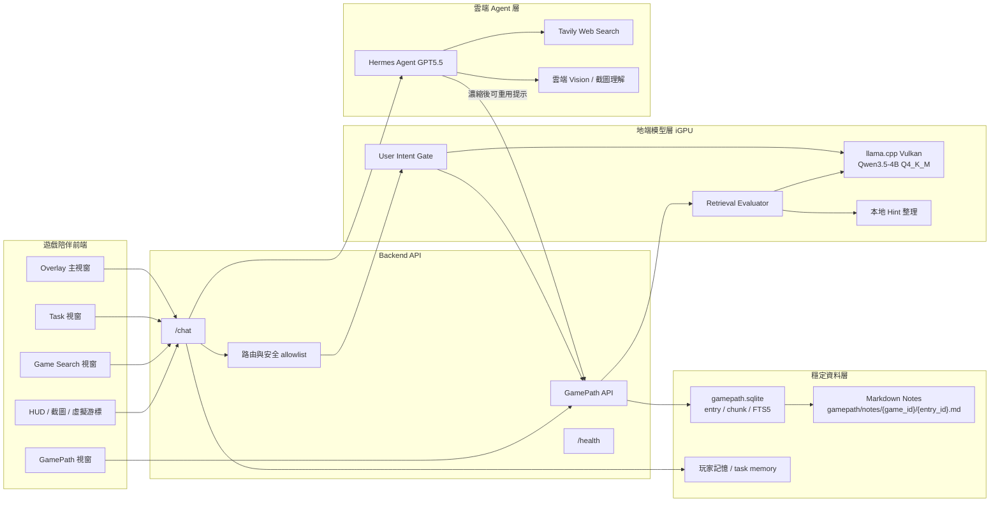
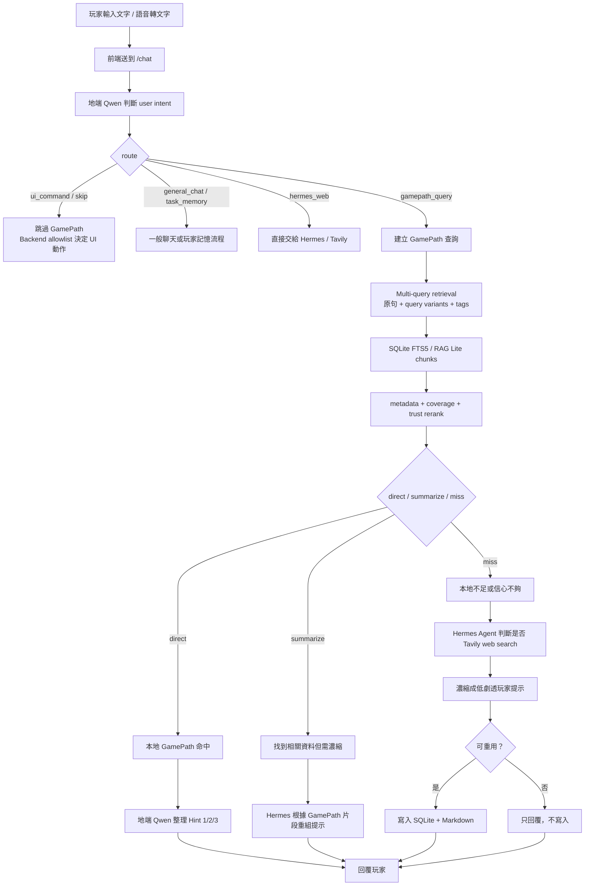
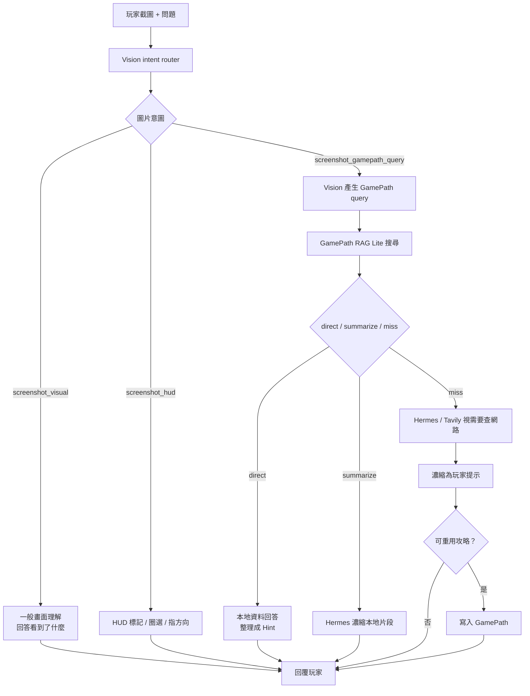
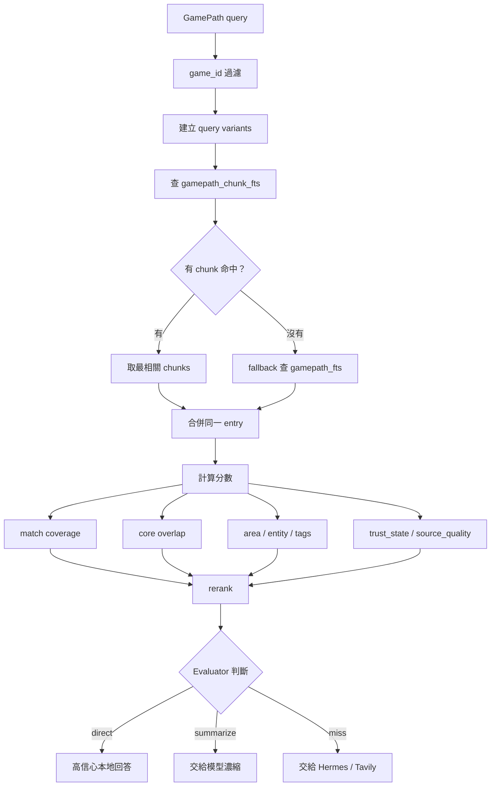
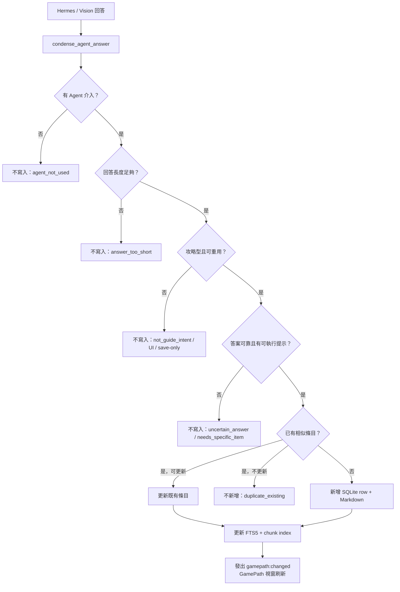

# GamePath 流程圖與架構圖

最後更新：2026-06-08

這份文件只整理 GamePath 的圖與角色分工，方便簡報或快速 review。完整細節仍以 `docs/gamepath_architecture.md` 為主。

## 1. 總體架構圖



## 2. 文字聊天主流程



## 3. 截圖 / HUD / 攻略混合流程



## 4. RAG Lite 內部搜尋流程



## 5. GamePath 寫回規則流程



## 6. direct / summarize / miss 意義

| 狀態 | 意義 | 下一步 |
| --- | --- | --- |
| `direct` | GamePath 本地資料高信心命中，答案範圍明確 | 地端 Qwen 整理成 Hint 1/2/3，直接回玩家 |
| `summarize` | 找到相關本地資料，但內容較長或需要重組 | Hermes 或模型根據本地片段濃縮，不查整個網路 |
| `miss` | 本地不足、候選太弱、或像硬湊 | 交給 Hermes GPT5.5，必要時 Tavily web search |

## 7. 狀態泡泡對照

| 泡泡狀態 | 代表意思 |
| --- | --- |
| `gamepath_skipped` | Qwen / Backend 判斷不用查 GamePath |
| `gamepath_hit` | GamePath 高信心命中，走本地快取 |
| `gamepath_summarizing` | GamePath 找到資料，但正在濃縮成玩家提示 |
| `gamepath_miss` | GamePath 未命中或信心不足，準備交給 Hermes / Tavily |
| `agent_may_search_web` | Hermes 可能會使用 Tavily 查網路 |
| `gamepath_stored` | 回答已濃縮並寫入 SQLite + Markdown |
| `gamepath_not_stored` | 回答不符合可重用規則，沒有寫入 |
| `gamepath_disputed` | 玩家回報提示不符，條目會降權或改走驗證流程 |

## 8. 一句話版

```text
地端 Qwen 判斷要不要查攻略；
GamePath 用 SQLite + Markdown 找本地可重用提示；
本地足夠就用 Hint 回答；
本地不足才交給雲端 Hermes GPT5.5 / Tavily；
雲端查到的內容會濃縮成可重用提示，再寫回 GamePath。
```
