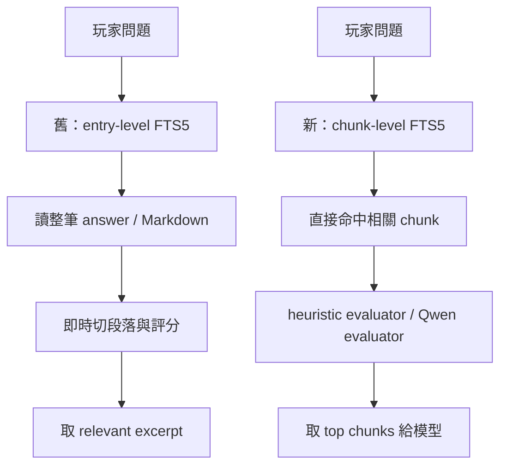

# GamePath RAG Lite 技術報告

產生時間：2026-05-31T21:42:55+0800

## 結論

GamePath RAG Lite 適合目前 iGPU + RAM 有限的架構，因為它不新增 embedding model，只用 SQLite FTS5 chunk index、中文 n-gram、後端 evaluator，以及必要時既有的地端 Qwen router/evaluator。

這次可控測試中：

- 舊 entry-level search 平均延遲：`8.9497` ms。
- RAG Lite chunk search 平均延遲：`7.9091` ms。
- 延遲改善：`11.63`%。
- CPU seconds delta：`2.9375`。
- RSS before/after：`49.07` / `61.25` MiB。
- GamePath DB 大小 before/after：`856.0` / `1088.0` KiB。
- 測試長攻略切出的 chunk 數：`88`。

## 架構差異

## 測試資料

- 測試 game_id：`__bench_rag_lite__`
- 測試內容：一份包含廚房、銀鑰匙、女殭屍、地下室謎題、最終 boss 劇透的長攻略。
- 測試完成後會刪除暫存 GamePath entries，不污染正式資料庫。

## 結果表

| Case | Old Avg ms | RAG Lite Avg ms | Old Context chars | RAG Context chars | Old Expected | RAG Expected | Old Forbidden | RAG Forbidden |
|---|---:|---:|---:|---:|---:|---:|---:|---:|
| silver_key_location | 9.9451 | 8.498 | 79 | 79 | yes | yes | no | no |
| kitchen_route | 9.4758 | 8.4214 | 98 | 184 | yes | yes | no | no |
| singing_zombies | 9.2431 | 6.7886 | 69 | 69 | yes | yes | no | no |
| unrelated_miss | 7.1349 | 7.9285 | 0 | 0 | no | no | no | no |

## 觀察

1. RAG Lite 把長攻略切 chunk 並寫入 `gamepath_chunks` / `gamepath_chunk_fts`，搜尋時不用每次重新讀整篇 Markdown 再切段。
2. 對 iGPU/RAM 友善：沒有新增 embedding model，也沒有新增常駐模型；只多一個 SQLite chunk index。
3. 對 LLM-wiki 友善：Markdown 仍是人類可讀 source，chunk index 是可刪可重建的衍生資料。
4. 對攻略回答比較安全：模型拿到的是 top chunk，不是整篇攻略，低劇透問題比較不容易帶出無關劇透段落。
5. unrelated miss 在這次測試中 RAG Lite 比舊搜尋慢，原因是 chunk FTS 需要掃過更多 chunk。實際聊天流程會先經過 GamePath router，非攻略或低可能性問題通常不會直接進入這條慢路徑。

## 驗收判斷

RAG Lite 比上一版好的地方：

- 大型 `.md` 攻略搜尋成本更固定。
- 未來可以直接從 LLM-wiki Markdown 重建 chunk index。
- 不需要額外 embedding 模型，符合 iGPU + RAM 限制。
- 可以保留現在的 Qwen local router/evaluator，不改掉雲端 Hermes 主流程。

仍然不是完整 semantic RAG：

- 短 query 的語意泛化仍主要靠 FTS5 n-gram 與 Qwen evaluator。
- 沒有 embedding，所以「完全不同說法但語意相同」仍可能 miss。
- 下一階段可以加 optional embedding adapter，但不應作為預設遊戲中模式。
