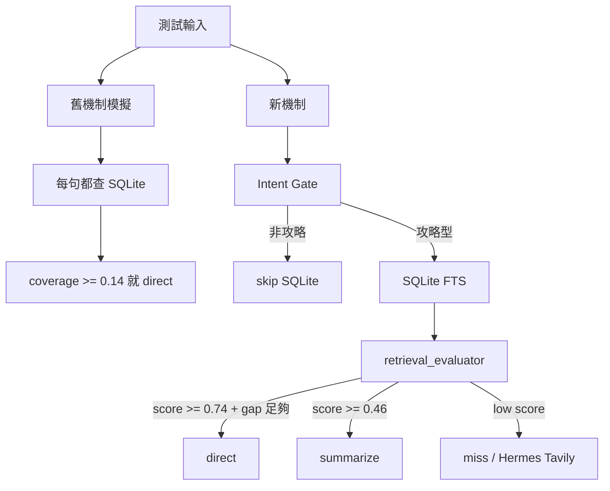

# GamePath Retrieval Evaluator 測試報告

產生時間：2026-05-31T10:25:28+0800

## 結論

新機制在這組可控測試中比較好，原因有三個：

- SQLite 查詢次數從 `6` 次降到 `3` 次，減少 `50.0%`。
- 路由判斷正確率從 `66.67%` 提升到 `100.0%`。
- 多筆相似攻略時，新 evaluator 會走 `summarize`，避免舊機制直接拿第一筆硬答。

這份測試不是代表所有遊戲都 100% 正確；它證明的是：在一般聊天、UI 指令、精準命中、多筆模糊命中、miss 這些典型情境下，新機制有更好的路由判斷與更少不必要 SQLite 查詢。

## 測試架構

## 測試資料

- 測試 game_id：`__bench_eval_gamepath__`
- 暫存資料：crystal key、ancient key left door、ancient key right door
- 測試完成後會刪除暫存 GamePath entries，不污染正式資料庫。

## 結果表

| Case | Expected | Old Route | New Route | Old Avg ms | New Avg ms | New Score |
|---|---:|---:|---:|---:|---:|---:|
| general_chat | skip | gamepath_context | skipped | 6.1501 | 0.0075 | 0.0 |
| ui_voice_command | skip | skipped_after_sqlite | skipped | 5.7977 | 0.002 | 0.0 |
| exact_item_hit | direct | direct | direct | 6.1144 | 6.4719 | 0.8 |
| ambiguous_multi_hit | summarize | direct | summarize | 5.9831 | 5.8116 | 0.96 |
| unrelated_guide_miss | miss | miss | miss | 5.6985 | 5.8632 | 0.0 |
| software_model_question | skip | skipped_after_sqlite | skipped | 6.0184 | 0.0047 | 0.0 |

## 整體指標

| Metric | Old | New |
|---|---:|---:|
| Route accuracy | 66.67% | 100.0% |
| SQLite query count | 6 | 3 |
| Avg route latency ms | 5.9604 | 3.0268 |
| CPU seconds delta | 2.1406 | same process |
| RSS before/after MiB | 49.11 / 58.05 | same process |

## 觀察

1. 一般聊天與 UI 指令現在會停在 intent gate，不再進 SQLite。
2. 精準同遊戲物品問題會得到高分，直接走 GamePath 本地回答。
3. `ancient key door guide` 這種多筆都合理的情境，舊機制會直接拿第一筆；新機制因為 top gap 不夠，改走模型濃縮。
4. 完全不相關的攻略問題仍會 miss，交給 Hermes/Tavily 慢路徑。

## 驗收判斷

這次改動「真的比較好」的範圍是：

- 非攻略訊息效能更好：少一次 SQLite FTS。
- 多筆命中品質更好：不急著 direct。
- UI 可觀察性更好：狀態會顯示 retrieval score。

還需要真實遊戲資料繼續驗證的是：

- 不同遊戲同名物品的邊界案例。
- 中文 OCR 或截圖物品名稱不完整時的 scoring。
- 大量 GamePath entries 超過數千筆後的 FTS 延遲。
