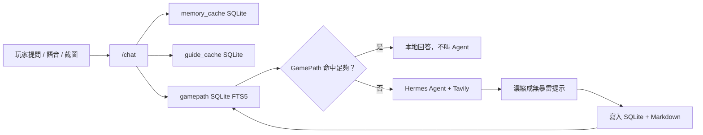

# GamePath 技術報告

## 目標

GamePath 是遊戲攻略陪伴用的穩定本地知識庫。它把「玩家可重用的攻略提示」存成兩份資料：

- SQLite：給雲端 Hermes Agent 與本地 llama.cpp/Qwen 快速查找。
- Markdown：給人類閱讀，也可作為未來 LLM-wiki 的素材。

這個資料層獨立於 `guide_cache` 與 `memory_cache`。`guide_cache` 是可重建攻略索引，`memory_cache` 是玩家狀態/任務記憶，`gamepath` 則是長期保留的攻略提示。

## 架構



## 資料模型

主要 API：

- `POST /gamepath/add`：手動或後端寫入濃縮攻略。
- `POST /gamepath/search`：依 `game_id`、query、tags、spoiler level 搜尋。
- `GET /gamepath/recent`：列出最近保存的攻略提示。
- `GET /health`：回報 `gamepath_enabled`、`gamepath_db_exists`、`gamepath_entry_count`。

SQLite 欄位包含：

- `game_id`
- `title`
- `question`
- `answer_summary`
- `markdown_path`
- `tags`
- `spoiler_level`
- `source_type`
- `agent_used`
- `created_at`
- `updated_at`

搜尋使用 SQLite FTS5，並沿用既有中文 n-gram 擴展。查詢前會做輕量 query expansion，例如把「物品用途」延伸成用途、材料、配方、NPC、任務、解鎖等搜尋語意，降低只靠單一關鍵字造成的發散。

## 寫入時機

GamePath 不保存 raw Tavily search result，也不保存來源清單。寫入時機如下：

- 手動：呼叫 `/gamepath/add` 或未來 UI 的「存到 GamePath」。
- 自動：Hermes Agent 回答後，後端判斷內容是攻略/教學/物品用途/任務/boss/地圖提示，且回答足夠明確。
- 不寫入：閒聊、不確定答案、錯誤訊息、timeout、沒有 `game_id` 的內容、過短答案、包含明顯失敗文字的答案。

## Agent 介入規則

`/chat` 會先查本地資料：

1. `memory_cache`
2. `gamepath`
3. `guide_cache`

如果 GamePath 有足夠命中，直接回覆本地紀錄，不呼叫 Hermes Agent。只有在 GamePath/guide 不足且問題屬於攻略查詢時，才讓 Hermes Agent 判斷是否使用 Tavily。Agent 不直接操作 SQLite，後端負責搜尋與寫入。

## 效能測試方法

使用：

```powershell
python scripts\bench_gamepath.py --runs 3
python scripts\bench_gamepath.py --runs 1 --include-agent --agent-timeout 180
```

測試案例：

| Case | 說明 |
| --- | --- |
| A | 無 Agent，直接 `/gamepath/add` 寫入 SQLite + Markdown |
| B | 無 Agent，直接 `/gamepath/search` 讀取 |
| C | 有 Agent，GamePath miss → Hermes/Tavily → 濃縮 → 寫入 |
| D | 有 Agent，但 GamePath hit → 直接本地回覆，不查網路 |

量測項目：

- elapsed ms
- backend CPU seconds delta
- estimated CPU percent
- RSS memory
- SQLite DB size before/after
- 成功/失敗次數

## 實測結果

測試時間：2026-05-30。  
測試環境：`IGPU_CHAT_BACKEND=hermes`、`HERMES_AGENT_WEB_ENABLED=1`、model alias `gpt-5.5-hermes`、llama.cpp auto-start disabled。  
詳細 JSON：`docs/gamepath_benchmark_results.json` 與 `docs/gamepath_benchmark_results_agent.json`。

| Case | Runs | OK | Avg ms | P50 ms | P95 ms | Avg CPU sec | Max RSS MiB | 備註 |
| --- | ---: | ---: | ---: | ---: | ---: | ---: | ---: | --- |
| A_no_agent_write_api | 5 | 5 | 25.20 | 27.77 | 35.94 | 0.0062 | 63.29 | 直接寫入 SQLite + Markdown |
| B_no_agent_read_api | 5 | 5 | 15.86 | 10.55 | 30.68 | 0.0031 | 64.94 | SQLite FTS5 查詢 |
| C_agent_miss_chat_write | 1 | 1 | 20300.68 | 20300.68 | 20300.68 | 0.1250 | 64.55 | GamePath miss，Hermes/Tavily 慢路徑 |
| D_agent_enabled_local_hit_chat | 1 | 1 | 14.40 | 14.40 | 14.40 | 0.0000 | 65.10 | Hermes 模式下仍由 GamePath 本地命中 |

## 初步結論

- 本地 GamePath hit 是最低延遲路徑；本次 Hermes 模式下的本地命中約 14.40 ms。
- `/gamepath/add` 多一次 Markdown 寫入，但平均仍約 25.20 ms，低於 200 ms 驗收目標。
- `/gamepath/search` 平均約 15.86 ms，低於 100 ms 驗收目標。
- Agent/Tavily miss 約 20.30 秒，主要成本在 Hermes Agent、網路搜尋與雲端模型回覆。
- GamePath 的價值很明確：第一次查攻略可走 Agent 慢路徑；第二次同類問題走本地命中，能大幅降低等待時間與 token 成本。
